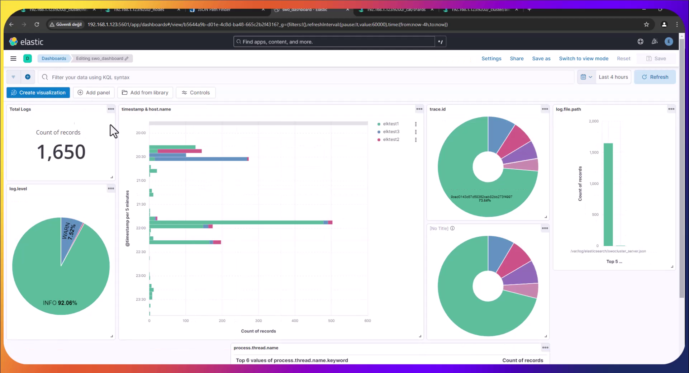

# ELK Stack Mastery: Building a Scalable Log Management System

## Overview

This project sets up an Elastic Cluster with 3 nodes using Virtualbox virtual machines. It includes the setup of Elasticsearch, Logstash, and Kibana (ELK stack) for log management and analysis.

## Project Goals

- Set up Elastic Cluster with all necessary components.
- Create an index with a retention period of 10 days in Hot, 10 days in Cold, and 10 days in Frozen tiers.
- Load logs using one of the methods listed in the setup.
- Create a Dashboard with drilldown capabilities.

## Prerequisites

- VirtualBox installed on your system
- Debian 12 ISO image
- Sufficient system resources to run 3 VMs

## VM Configuration

Create 3 VMs with the following specifications:

1. **elktest1** (Master + Data_Hot + Data_Content, Kibana, Logstash)
    - 8 GB RAM, 4 CPU, 40 GB storage
2. **elktest2** (Data_Cold, Logstash)
    - 8 GB RAM, 4 CPU, 40 GB storage
3. **elktest3** (Data_Frozen, Logstash)
    - 6 GB RAM, 3 CPU, 50 GB storage

## Setup Instructions

### 1. VM Installation

1. Download Debian 12 ISO:
    
    ```
    <https://cdimage.debian.org/debian-cd/current/amd64/iso-cd/debian-12.7.0-amd64-netinst.iso>
    ```
    
2. Install Debian on each VM.
3. In VM settings, change network from NAT to Bridged Adapter.

### 2. SSH Setup

Install SSH on each VM:

```bash
su -
apt-get update
apt-get install openssh-server
systemctl start ssh
systemctl enable ssh
```

Reboot and get IP addresses:

```bash
reboot now
ip addr show
```

Connect from host machine:

```bash
ssh <username>@<your_ip_address>
```

### 3. Elasticsearch Installation

On all VMs:

```bash
apt install curl
curl -fsSL <https://artifacts.elastic.co/GPG-KEY-elasticsearch> | gpg --dearmor -o /usr/share/keyrings/elastic.gpg
echo "deb [signed-by=/usr/share/keyrings/elastic.gpg] <https://artifacts.elastic.co/packages/8.x/apt> stable main" | tee -a /etc/apt/sources.list.d/elastic-8.x.list
apt update
apt install elasticsearch
```

### 4. Elasticsearch Configuration

### On elktest1:

1. Edit `/etc/elasticsearch/elasticsearch.yml`:
    
    ```yaml
    cluster.name: elktestcluster
    node.name: elktest1
    node.roles: ["master","data_hot","data_content"]
    cluster.initial_master_nodes: ["elktest1"]
    path.data: /var/lib/elasticsearch
    path.logs: /var/log/elasticsearch
    network.host: 0.0.0.0
    http.port: 9200
    discovery.seed_hosts: ["elktest1"]
    xpack.security.enabled: true
    xpack.security.enrollment.enabled: true
    xpack.security.http.ssl:
      enabled: true
      keystore.path: certs/http.p12
    xpack.security.transport.ssl:
      enabled: true
      verification_mode: certificate
      keystore.path: certs/transport.p12
      truststore.path: certs/transport.p12
    http.host: 0.0.0.0
    ```
    
2. Start Elasticsearch:
    
    ```bash
    systemctl start elasticsearch
    ```
    
3. Reset elastic user password:
    
    ```bash
    /usr/share/elasticsearch/bin/elasticsearch-reset-password -i -u elastic
    ```
    
4. Generate enrollment tokens for other nodes:
    
    ```bash
    cd /usr/share/elasticsearch/bin
    ./elasticsearch-create-enrollment-token -s node
    ```
    

### On elktest2 and elktest3:

1. Reconfigure node with enrollment token:
    
    ```bash
    cd /usr/share/elasticsearch/bin
    ./elasticsearch-reconfigure-node --enrollment-token <your_enrollment_token>
    ```
    
2. Edit `/etc/elasticsearch/elasticsearch.yml`:
    
    For elktest2:
    
    ```yaml
    cluster.name: elktestcluster
    node.name: elktest2
    node.roles: ["data_cold"]
    path.data: /var/lib/elasticsearch
    path.logs: /var/log/elasticsearch
    network.host: 0.0.0.0
    http.port: 9200
    ```
    
    For elktest3:
    
    ```yaml
    cluster.name: elktestcluster
    node.name: elktest3
    node.roles: ["data_frozen"]
    path.data: /var/lib/elasticsearch
    path.logs: /var/log/elasticsearch
    network.host: 0.0.0.0
    http.port: 9200
    xpack.searchable.snapshot.shared_cache.size: 30%
    ```
    
3. Start Elasticsearch on both nodes:
    
    ```bash
    systemctl start elasticsearch
    ```
    

### 5. Index Lifecycle Management

Create ILM policy:

```bash
PUT _ilm/policy/elktestcluster_logs_policy
{
    "policy": {
        "phases": {
            "hot": {
                "actions": {
                    "rollover": {
                        "max_size": "40gb",
                        "max_age": "10d"
                    }
                }
            },
            "warm": {
                "min_age": "10d",
                "actions": {
                    "forcemerge": {
                        "max_num_segments": 1
                    },
                    "allocate": {
                        "require": {
                            "data": "cold"
                        }
                    }
                }
            },
            "cold": {
                "min_age": "20d",
                "actions": {
                    "freeze": {},
                    "allocate": {
                        "require": {
                            "data": "frozen"
                        }
                    }
                }
            }
        }
    }
}
```

Assign policy to index template:

```bash
PUT _index_template/elktestcluster_logs_template
{
  "index_patterns": ["elktestcluster-logs-*"],
  "template": {
    "settings": {
      "number_of_shards": 1,
      "number_of_replicas": 1,
      "index.lifecycle.name": "elktestcluster_logs_policy",
      "index.lifecycle.rollover_alias": "elktestcluster-logs"
    }
  }
}
```

### 6. Logstash Setup

Install Logstash on all VMs:

```bash
apt install logstash -y
```

Add logstash user to elasticsearch group:

```bash
sudo usermod -aG elasticsearch logstash
```

Create Logstash pipeline configuration:

```bash
nano /etc/logstash/conf.d/elktestcluster-logs.con
```

Add the following content:

```
input {
  file {
    path => [
      "/var/log/elasticsearch/elktestcluster*.json"
    ]
    start_position => "beginning"
    sincedb_path => "/dev/null"
    codec => "json"
  }
}

output {
  elasticsearch {
    hosts => ["<https://elktest1:9200>", "<https://elktest2:9200>", "<https://elktest3:9200>"]
    index => "elktestcluster-logs-%{+YYYY.MM.dd}"
    user => "elastic"
    password => "elastic"
    ssl => true
    cacert => "/etc/elasticsearch/certs/http_ca.crt"
  }
}
```

Start Logstash on all VMs:

```bash
systemctl start logstash
```

### 7. Kibana Setup

Install Kibana on one VM (preferably elktest1 or elktest2):

```bash
apt install kibana -y
```

Reset kibana_system user password:

```bash
/usr/share/elasticsearch/bin/elasticsearch-reset-password -i -u kibana_system
```

Configure Kibana:

```bash
nano /etc/kibana/kibana.yml
```

Add/edit the following:

```yaml
server.port: 5601
server.host: "0.0.0.0"
elasticsearch.hosts: ["<https://elktest1:9200>", "<https://elktest2:9200>", "<https://elktest3:9200>"]
elasticsearch.username: "kibana_system"
elasticsearch.password: "kibana"
elasticsearch.ssl.verificationMode: none
```

Start Kibana:

```bash
systemctl start kibana
```

### 8. Accessing Kibana

Open a web browser and go to:

```
http://<your_kibana_machine_ip>:5601
```

Use the Elasticsearch credentials:

- Username: elastic
- Password: elastic

## Final Steps

1. Create a data view from cluster logs in Kibana.
2. Create a dashboard from the data view.



Congratulations! You have now set up a complete ELK stack for log management and analysis.